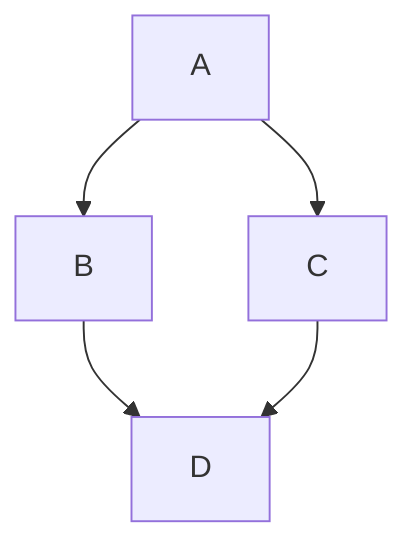
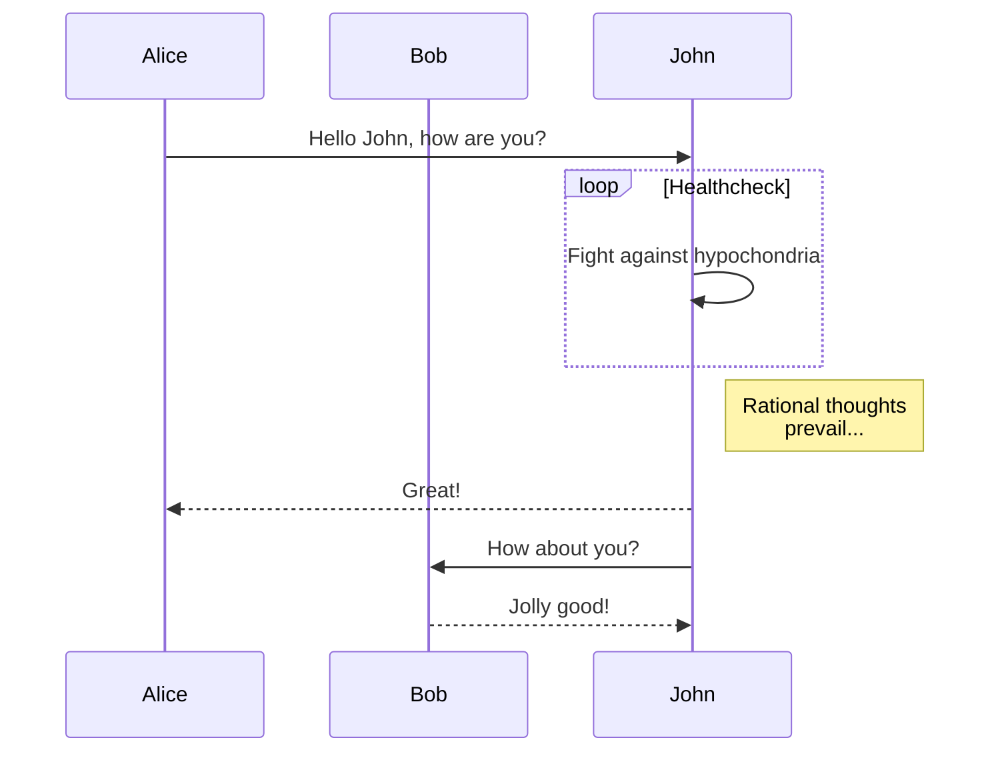
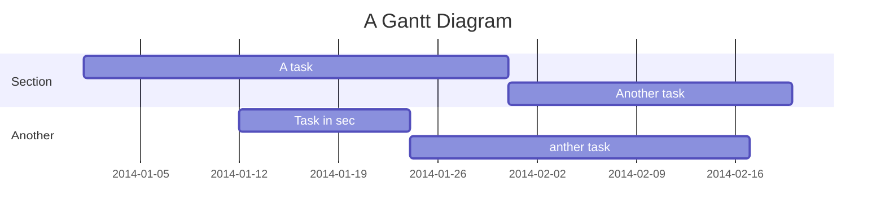
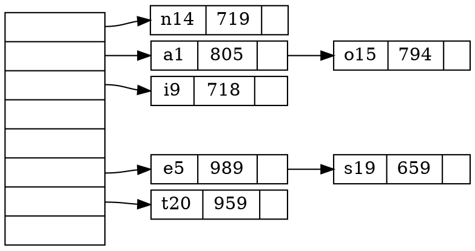
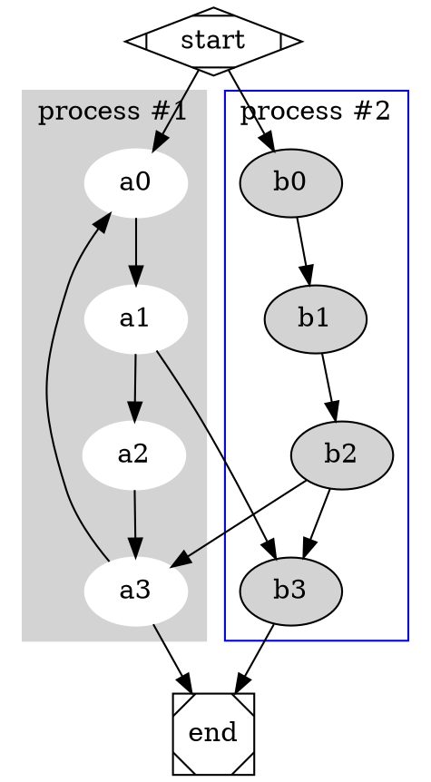
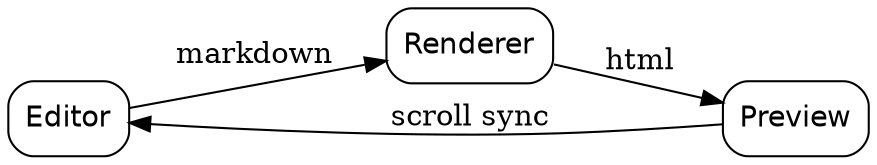

# MacDown feature demo

This document exercises every rendering feature MacDown supports, so it can be
used to eyeball the preview after a change.

Most features are switches in **Preferences → Rendering** and
**Preferences → Markdown**. Anything that looks like literal source text below
simply means the matching option is switched off — turn it on and re-render.

[TOC]

## Inline formatting

Some **bold** text, some *italic* text, and some `inline code`.

| Feature | Option | Example |
|:--------|:-------|:--------|
| Intra-word emphasis | Intra-emphasis | intra_word_underscores_stay_literal |
| Strikethrough | Strikethrough | ~~struck out~~ |
| Underline | Underline | _underlined_ |
| Superscript | Superscript | 2^10 equals 1024 |
| Highlight | Highlight | ==highlighted== |
| Smart typography | SmartyPants | "curly quotes" -- en dash, ellipsis... |
| Autolink | Autolink | https://macdown.uranusjr.com |

A footnote reference sits here[^demo], and the body is collected at the end of
the document.

[^demo]: Footnotes are the "Footnotes" option. This is the footnote body.

## Headings

Headings become anchors, so an in-document link such as
[jump to Tables](#tables) scrolls the preview.

### Heading level three

#### Heading level four

##### Heading level five

###### Heading level six

## Lists

- unordered item
- another item
  - nested item
    - deeply nested item
- back to the top level

1. ordered item
2. second item
   1. nested ordered item
3. third item

Task lists need the "Task list" option:

- [x] a completed task
- [ ] an outstanding task
- [ ] another outstanding task

## Blockquote

> A blockquote, which may contain **bold** text and `code`.
>
> > And a nested blockquote inside it.

## Tables

Alignment is controlled by the colons in the separator row.

| Left aligned | Centred | Right aligned |
|:-------------|:-------:|--------------:|
| apples       |   red   |          1.50 |
| pears        |  green  |         12.00 |
| plums        | purple  |        123.75 |

## Code

Fenced code is highlighted by Prism when "Syntax highlighting" is on. The
language label in the corner is the "Code block accessory" option, and
"Line numbers" adds the gutter.

```python
def fibonacci(n):
    """Return the nth Fibonacci number."""
    a, b = 0, 1
    for _ in range(n):
        a, b = b, a + b
    return a
```

```javascript
const greet = (name) => {
  console.log(`Hello, ${name}!`);
  return { ok: true, count: 42 };
};
```

```objectivec
- (void)renderPreview:(NSString *)html baseURL:(NSURL *)url
{
    self.currentNavigation = [self.preview loadHTMLString:html baseURL:url];
}
```

```c
#include <stdio.h>

int main(void) {
    printf("hello\n");
    return 0;
}
```

An indented code block, with no language attached:

    plain indented code
    second line

## Mathematics

Formulas are typeset by MathJax, which is the "MathJax" option. Note that
MathJax loads from a CDN, so it needs a network connection.

Inline math written with backslash-parens: \( E = mc^2 \).

With "Inline dollar" also enabled, $a^2 + b^2 = c^2$ works too.

Display math:

$$
\int_{-\infty}^{\infty} e^{-x^2}\,dx = \sqrt{\pi}
$$

$$
\frac{\partial u}{\partial t} = \alpha \nabla^{2} u
$$

## Images

Images resolve relative to the document, so this one loads the screenshot
sitting beside this file:


## Graph visualization

Two graph grammars are supported, mermaid and graphviz. Enable `Mermaid`
and/or `Graphviz` in **Preferences → Rendering**.

### Mermaid

[mermaid](https://github.com/knsv/mermaid) has 3 diagram syntaxes.

#### Flow chart



#### Sequence diagram



#### Gantt



### Graphviz

> Graphviz is open source graph visualization software. Graph visualization is
> a way of representing structural information as diagrams of abstract graphs
> and networks. It has important applications in networking, bioinformatics,
> software engineering, database and web design, machine learning, and in
> visual interfaces for other technical domains.

Please refer to the [Graphviz website](http://www.graphviz.org/Home.php) for
details. The available engines are `circo`, `dot`, `fdp`, `neato`, `osage` and
`twopi`.

#### Hashmap



#### Process diagram with clusters



#### Rendering pipeline



## Horizontal rule

Three or more dashes on their own line produce a rule:

---

## Raw HTML

Inline HTML passes straight through: <kbd>⌘</kbd> + <kbd>R</kbd> re-renders the
preview.

<div align="center">
  <strong>A centred block-level HTML element.</strong>
</div>

## Long section for scroll sync

The headings below exist so that scroll synchronisation between the editor and
the preview can be exercised over a document that is taller than one screen.

### Scroll target A

Lorem ipsum dolor sit amet, consectetur adipiscing elit. Sed do eiusmod tempor
incididunt ut labore et dolore magna aliqua. Ut enim ad minim veniam, quis
nostrud exercitation ullamco laboris nisi ut aliquip ex ea commodo consequat.

### Scroll target B

Duis aute irure dolor in reprehenderit in voluptate velit esse cillum dolore eu
fugiat nulla pariatur. Excepteur sint occaecat cupidatat non proident, sunt in
culpa qui officia deserunt mollit anim id est laborum.

### Scroll target C

Sed ut perspiciatis unde omnis iste natus error sit voluptatem accusantium
doloremque laudantium, totam rem aperiam, eaque ipsa quae ab illo inventore
veritatis et quasi architecto beatae vitae dicta sunt explicabo.

### Scroll target D

Nemo enim ipsam voluptatem quia voluptas sit aspernatur aut odit aut fugit, sed
quia consequuntur magni dolores eos qui ratione voluptatem sequi nesciunt.

### Scroll target E

Neque porro quisquam est, qui dolorem ipsum quia dolor sit amet, consectetur,
adipisci velit, sed quia non numquam eius modi tempora incidunt ut labore et
dolore magnam aliquam quaerat voluptatem.

### Scroll target F

Ut enim ad minima veniam, quis nostrum exercitationem ullam corporis suscipit
laboriosam, nisi ut aliquid ex ea commodi consequatur.

## End

The final paragraph, used to confirm that the bottom of the document is
reachable and that the footnote block renders below it.
